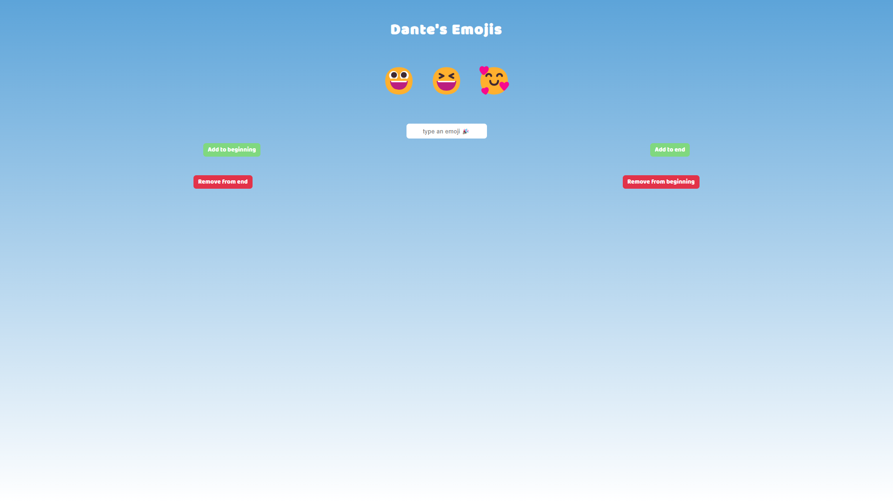

# Emoji Personality

This is a web application that allows you to create your personality in emoji form!

## Table of contents

-   [Overview](#overview)
    -   [Screenshot](#screenshot)
    -   [Links](#links)
-   [My process](#my-process)
    -   [Built with](#built-with)
    -   [What I learned](#what-i-learned)
-   [Author](#author)

## Overview

### Screenshot

### Links

-   Live Site URL: [GitHub Pages](https://dpass47.github.io/emoji-personality/)
-   Emoji Site to Copy from: [Get Emoji](https://getemoji.com/)

## My process

I built the initial layout for this application with HTML, and I styled the webpage using CSS. I moved on to writing the JavaScript to add functionality to the app with input field and buttons. This project was specifically created to allow me to practice with JavaScript array methods. To achieve the functionality with all the buttons, I used the pop, push, shift, and unshift methods available to arrays. I also added a prompt when the webpage is loaded for use of adding the user's name to showcase their personal emojis.

### Built with

-   HTML
-   CSS
-   JavaScript
-   Mobile-first workflow

### What I learned

I learned more about JavaScript arrays and the different methods for editing the array. I felt like I gained a lot of practice with using the different methods, as I created multiple buttons that would need different methods for the function of the button.

## Author

-   Website - [Dante Passalacqua](https://www.devdante.com)
-   Twitter - [@dpass47](https://www.twitter.com/dpass47)
